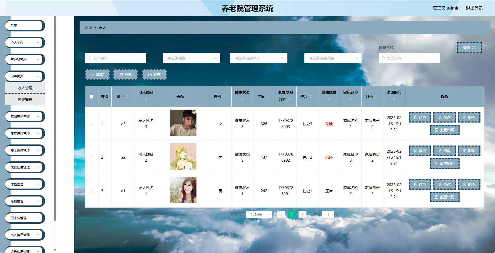
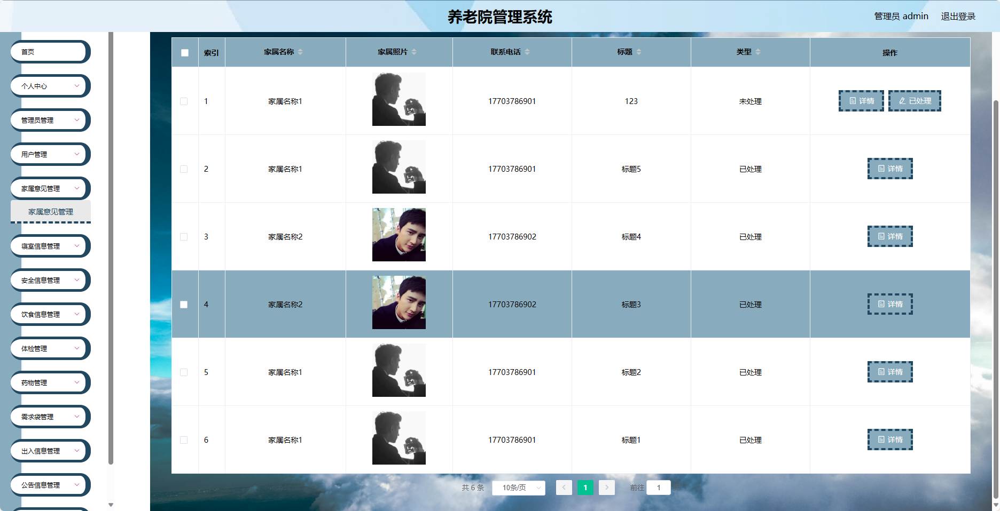
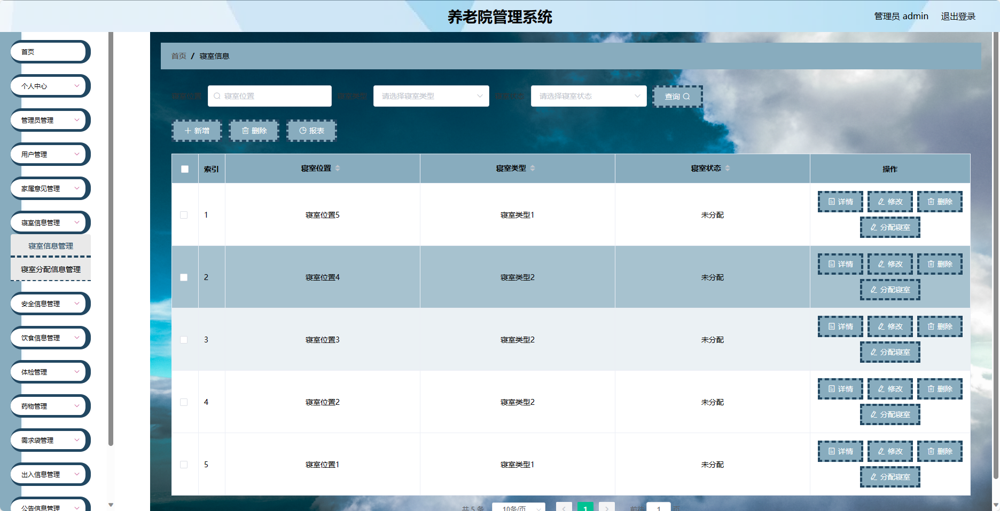
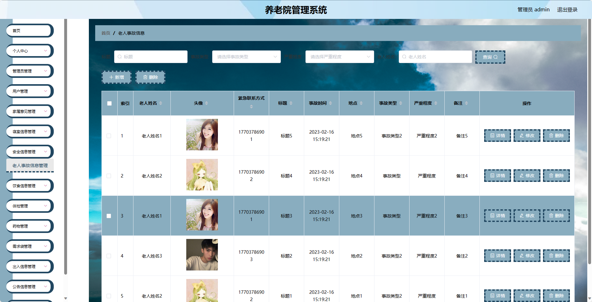
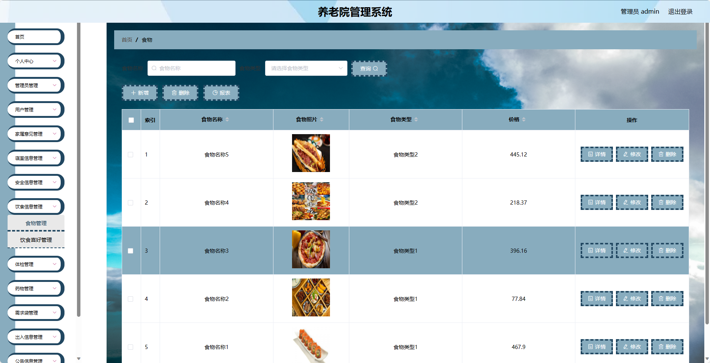
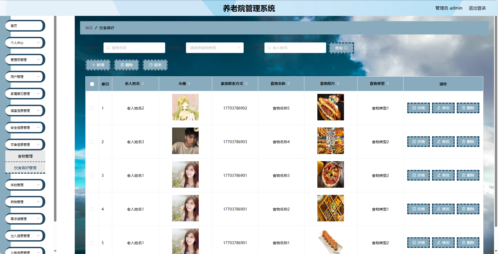
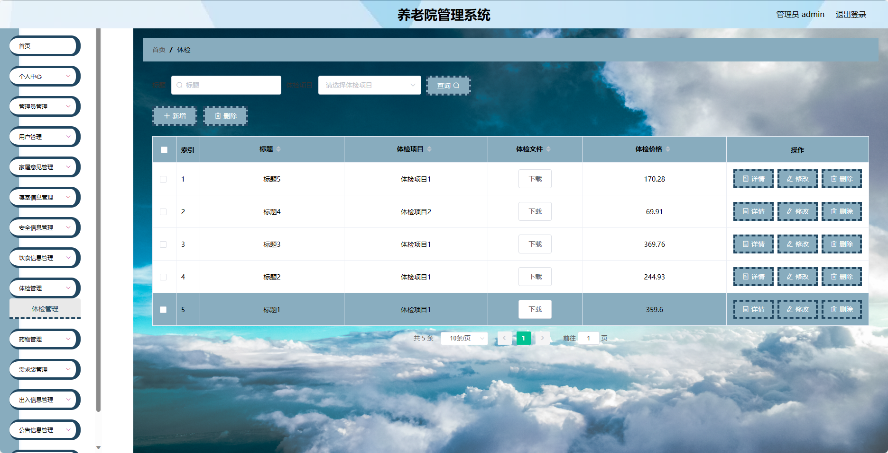

<h1 align="center">基于SpringBoot框架实现的养老院管理系统【带文档】</h1>

 获取sql文件 QQ: 3645296857 QQ群: 978300347 

<h4> 需要视频演示可联系上述QQ，私发视频链接 </h4>

 获取更多高质量源码，请访问：[mzoo源码网](https://mzoocodes.com/)

## 简介

> 本代码来源于网络,仅供学习参考使用!
>
> <b style="color: dodgerblue"> 提供1.远程部署/2.修改代码/3.定制程序/4.文档指导/5.框架代码讲解、技术解答、代码讲解等服务 </b>
>
> 前端地址：
> 
> 管理员: admin 密码: admin
> 
> 家属：a3 密码：123456 
> 
> 老人：a1 密码：123456

## 项目介绍

基于SpringBoot框架实现的养老院管理系统【带文档】：前端 JSP，后端 SpringMvc、Mybatis，系统角色分为：管理员、老人和家属，管理员在管理后台用户信息、公告信息、家属意见管理等；家属可以提交意见并且对老人饮食管理等；老人可以查看自己的体检并且对出入管理等。主要功能如下：

### 管理员

- 个人中心: 管理员可以查看和编辑个人信息。
- 管理员管理: 管理员可以对其他管理员进行管理。
- 用户管理: 管理员可以对家属和老人进行管理。
- 家属意见管理: 管理员可以查看和回复家属意见和反馈。
- 寝室信息管理: 管理员可以管理养老院内寝室的信息。
- 安全信息管理: 管理员可以管理养老院内的安全信息。
- 饮食信息管理: 管理员可以管理老人的饮食信息。
- 体检管理：管理员可以记录和管理老人的体检信息。
- 药物管理：管理员可以管理老人的药物信息。
- 需求袋管理：管理员可以管理老人的需求袋信息。
- 出入信息管理：管理员可以记录和管理老人的出入信息
- 公告信息管理：管理员可以发布和管理养老院的公告信息。
- 基础数据管理：管理员可以管理系统的基础数据。

### 家属

- 个人中心：家属可以查看和编辑个人信息。
- 老人管理：家属可以管理自己关联的老人信息。
- 家属意见管理：家属可以提交意见和建议。
- 寝室信息管理：家属可以查看和管理老人所在寝室的信息。
- 安全信息管理：家属可以查看和管理老人的安全信息。
- 饮食信息管理：家属可以查看和管理老人的饮食信息。
- 体检管理：家属可以查看和记录老人的体检信息。
- 出入信息管理：家属可以记录和查看老人的出入信息。

### 老人

- 个人中心：老人可以查看和编辑个人信息。
- 寝室信息管理：老人可以查看和管理自己所在寝室的信息。
- 安全信息管理：老人可以查看和管理自己的安全信息。
- 饮食信息管理：老人可以查看和管理自己的饮食信息。
- 体检管理：老人可以查看和记录自己的体检信息。
- 药物管理：老人可以查看和管理自己的药物信息。
- 需求袋管理：老人可以提交自己的需求和请求。
- 出入信息管理：老人可以记录和查看自己的出入信息。
- 公告信息管理：老人可以查看和阅读养老院发布的公告信息。

## 环境

- <b>IntelliJ IDEA 2020.3</b>

- <b>Mysql 5.7.26</b>

- <b>Tomcat 8.0.32</b>

- <b>JDK 1.8</b>

## 运行截图

